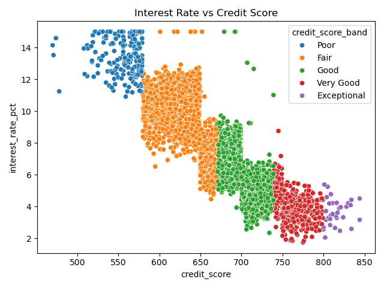
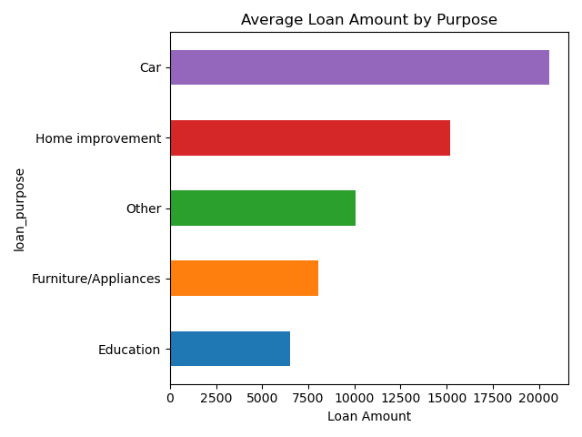

# Credit Data Analysis

## Table of Contents

- [Executive Summary](#executive-summary)  
- [Introduction & Objective](#introduction--objective)  
- [Data Description](#data-description)  
- [Methodology](#methodology)  
- [Python Analysis](#python-analysis)  
  - [Default Rate by Age Group](#default-rate-by-age-group)  
  - [Employment Status Distribution](#employment-status-distribution)  
  - [Interest Rate vs Credit Score](#interest-rate-vs-credit-score)  
  - [Average Loan Amount by Purpose](#average-loan-amount-by-purpose)  
- [R Analysis](#r-analysis)  
  - [Default Rate by Annual Income Band](#default-rate-by-annual-income-band)  
  - [Default Rate by Credit Score Band](#default-rate-by-credit-score-band)  
  - [Default Rate by Education Level](#default-rate-by-education-level)  
  - [Default Rate by Employment Status](#default-rate-by-employment-status)  
  - [Default Rate by Loan Purpose](#default-rate-by-loan-purpose)  
- [Conclusions & Recommendations](#conclusions--recommendations)  
- [Appendix](#appendix)  

---

## Executive Summary

- **Age & Life-Cycle**: Borrowers aged **36–55** show the lowest defaults (2.7–3.7%), while the youngest (18–25 at 4.3%) and oldest (66–75 at 4.9%) exhibit higher risk.  
- **Employment Profile**: Full-time employed (55% of borrowers) and retirees carry the lowest default rates (~3.2%), whereas students (5.2%) and part-time workers (4.0%) are notably riskier.  
- **Credit Score Stratification**: Default rate declines sharply from **8.1%** for “Poor” to **0%** for “Exceptional,” with interest rates falling from ~15% to ~2–5%.  
- **Income Gradient**: Lower-income borrowers (0–24 k €) default at 4.4%, compared to just 2.4% for those earning over 60 k €.  
- **Loan Purpose & Size**: Car loans average €21 k and default at 3.9%; home-improvement loans average €15 k with a lower default of 3.2%.  

These insights enable Austrian lenders to tailor credit policies, optimize pricing, and strengthen risk management by focusing on the most reliable borrower segments.

---

## Introduction & Objective

This report presents a comprehensive descriptive analysis of **Austrian consumer-loan** data. It aims to:

1. **Identify** borrower attributes—demographic, financial, and loan-specific—that correlate with default risk.  
2. **Provide** Austrian market context to explain observed patterns.  
3. **Recommend** underwriting and pricing strategies for Austrian lenders to balance portfolio growth and credit quality.

---

## Data Description

- **Scope**: Anonymized Austrian consumer-loan records.  
- **Key Variables**:  
  - **Demographics**: Age group, education level, employment status.  
  - **Financials**: Annual income band, credit score band, interest rate, loan amount.  
  - **Loan**: Purpose category.  
  - **Outcome**: Default flag within 12 months.  

Data are aggregated into categorical bands to preserve confidentiality while enabling robust analysis.

---

## Methodology

- **Tools**:  
  - **Python** (pandas, Matplotlib, Seaborn) for exploratory charts and correlation analysis.  
  - **R** (tidyverse, ggplot2) for detailed default-rate breakdowns by category.  
- **Process**:  
  1. Compute default rates per subgroup.  
  2. Visualize distributions, correlations, and trends.  
  3. Interpret findings in the context of Austrian socio-economic and regulatory factors.  
- **Deliverables**:  
  - Four Python-based charts with detailed commentary.  
  - Five R-based charts with deep dives on default drivers.  

---

## Python Analysis

### Default Rate by Age Group

- **Analysis:**  
  - A pronounced **U-shape**: highest defaults at 18–25 (4.3%) and 66–75 (4.9%); lowest at 56–65 (2.7%).  
  - Slight uptick at 36–45 (3.7%) relative to 26–35 (3.1%) suggests that larger loan sizes (home, auto) in this cohort increase exposure.  

- **Austrian Context:**  
  - **Youth:** NEET rate (~12% for 18–24) and limited credit history elevate risk.  
  - **Mid-Career:** Peak earning years (ages 36–55) coincide with stable employment and higher savings.  
  - **Seniors:** Dependence on fixed pensions (~€25.8 k median) can strain budgets amid healthcare costs.  

- **Sub-conclusion:**  
  Borrowers aged **36–55** offer the best risk profile. Enhanced income verification and conservative limits are advisable for the youngest (<26) and oldest (>65) applicants.

---

### Employment Status Distribution

- **Analysis:**  
  - **Employed** comprises 55% of the portfolio and shows a default rate of ~3.2%.  
  - **Students** (5.1% of borrowers) default at 5.2%; **Part-time** at 4.0%; **Unemployed** at 3.9%.  
  - **Self-employed** show a moderate default of 3.4%, reflecting business income variability.  

- **Austrian Context:**  
  - Robust unemployment benefits and pension system support borrowers during income shocks.  
  - High vocational training (70% of upper-secondary students in VET) fosters stable self-employment.  
  - Student borrowing often coincides with limited state grants or part-time work, heightening default risk.  

- **Sub-conclusion:**  
  Full-time employed and retirees are low-risk. For students and irregular workers, require co-signers or tighter collateral requirements.

---

### Interest Rate vs Credit Score

- **Analysis:**  
  - A strong **negative correlation**: as credit score increases, interest rate declines from ~15% (score <580) to ~2–5% (score >750).  
  - Cluster of borrowers around the 600–700 range face mid-single to low double-digit rates (6–12%).  
  - Zero defaults observed in the “Exceptional” band, underscoring perfect alignment of pricing and risk.  

- **Austrian Context:**  
  - Austria’s credit bureaus (KSV/CRIF) aggregate rich repayment histories, enabling precise risk-based pricing.  
  - Regulatory guidance caps interest spreads, but banks maintain sufficient margin via score differentiation.  

- **Sub-conclusion:**  
  Credit score is the **single most predictive** factor for both price and default. Underwriting should enforce strict score cutoffs for favorable rates.

---

### Average Loan Amount by Purpose

- **Analysis:**  
  - **Car** loans average €21 k, reflecting high vehicle financing; default at 3.9%.  
  - **Home improvement** at €15 k with a lower 3.2% default, indicating strong collateral support.  
  - **Education** loans are smallest (~€7 k) with a 3.4% default, reflecting mixed revenue streams (grants, part-time work).  

- **Austrian Context:**  
  - High homeownership (54.5%) and stable real estate market underpin larger home-related loans.  
  - State subsidies and low tuition fees keep education loan sizes modest.  

- **Sub-conclusion:**  
  Loan purpose drives both amount and risk. Asset-backed lending (home) merits larger lines at lower rates; unsecured or depreciating-asset loans require tighter terms.

[💡 View the Python report](https://github.com/Dan103/Credit-Data-Analysis/blob/dd68f4f1668c9dab9b6f2bccefce564212432eda/Analysis.ipynb)

---

## R Analysis

### Default Rate by Annual Income Band

- **Analysis:**  
  - Default rate declines **monotonically**: 0–24 k (4.4%) → 24–60 k (3.2%) → 60 k+ (2.4%).  
  - The middle band (~€35 k median income) represents moderate risk, aligning with Austria’s income distribution.  

- **Austrian Context:**  
  - Progressive tax code and social supports cushion low earners, yet disposable income remains constrained below €24 k.  
  - High-earning professionals (>€60 k) typically have diversified income sources and robust savings.  

- **Sub-conclusion:**  
  Income band is a **key filter**. Lenders should set minimum income thresholds and scale credit limits to borrower earnings.

---

### Default Rate by Credit Score Band

- **Analysis:**  
  - Dramatic drop from **8.1%** (Poor) to **4.7%** (Fair) and further to **2.0%** (Good).  
  - Virtually no defaults at the top two bands (1.3% Very Good, 0% Exceptional).  

- **Austrian Context:**  
  - Mandatory credit reporting for loans >€75 k ensures comprehensive data for scoring.  
  - Banks rely on these scores for automated approvals on smaller loans as well.  

- **Sub-conclusion:**  
  Score bands should directly inform credit policy tiers—e.g., automated approval for Good+, manual review for Fair, decline or enhanced terms for Poor.

---

### Default Rate by Education Level

- **Analysis:**  
  - Minimal variation across levels: Pflichtschule (3.5%) → Lehre/AHS (3.4%) → Universität/FH (3.3%).  
  - Vocational graduates (Lehre) perform nearly on par with university graduates.  

- **Austrian Context:**  
  - Dual education system yields strong employability for vocational students.  
  - High adult educational attainment (88.6% with upper-secondary) compresses risk differences.  

- **Sub-conclusion:**  
  Education level adds **limited incremental** predictive power beyond income and credit score in Austria’s context.

---

### Default Rate by Employment Status

- **Analysis:**  
  - **Students** lead at 5.2%; **Part-time** 4.0%; **Unemployed** 3.9%.  
  - **Employed** and **Retired** both at ~3.2%, showing stability in wage and pension income.  

- **Austrian Context:**  
  - Generous benefits may temporarily mask payment capacity challenges once support ends.  
  - Self-employment support programs moderate but do not eliminate volatility for entrepreneurs.  

- **Sub-conclusion:**  
  Employment status is a **critical risk factor**. Implement stronger income documentation and contingency planning for variable-income groups.

---

### Default Rate by Loan Purpose

- **Analysis:**  
  - Car loans highest (3.9%), reflecting depreciation risk and larger average amounts.  
  - Home improvement lowest (3.2%), backed by property equity.  
  - “Other” category (2.7%) may include mixed-purpose or low-value loans with shorter tenors.  

- **Austrian Context:**  
  - Stable property market and high equity levels support home-related lending.  
  - Automotive market fluctuations and maintenance costs elevate auto-loan risk.  

- **Sub-conclusion:**  
  Purpose-based underwriting is essential: favor collateralized home loans, apply stricter criteria for vehicle and unsecured consumer loans.

[💡 View the R report](https://dan103.github.io/Credit-Data-Analysis/Analysis.html)

---

## Conclusions & Recommendations

- **Synthesis of Findings**  
  - **Demographics:** Prime-age, full-time employed, high-income borrowers are lowest risk.  
  - **Financial Metrics:** Credit score and income band drive default outcomes most strongly.  
  - **Loan Characteristics:** Collateral quality and loan size influence default rates by purpose.  

- **Strategic Recommendations**  
  - **Tiered Interest:** Offer increasingly favorable rates for borrowers with scores ≥700 and incomes ≥€60 k.  
  - **Credit Policy:** Enforce minimum income of €24 k and stable employment for unsecured loans.  
  - **Collateral & Guarantees:** Require collateral or co-signers for high-risk segments (students, part-timers, large car loans).  
  - **Product Structuring:** Promote shorter-term, fixed-rate loans for vulnerable borrowers in a rising-rate environment.  
  - **Monitoring & Education:** Implement financial literacy programs for young borrowers and early alerts for payment stress.  

- **Ideal vs. Worst Borrower Profiles**  
  - **Ideal:** Age 36–55, full-time employed, income >€60 k, credit score ≥700, home-improvement loan.  
  - **Worst:** Age 18–25 or 66–75, student/part-time/unemployed, income <€24 k, credit score <600, large car loan.  

---

## Appendix

- **Data Sources:** Internal Austrian bank records; KSV/CRIF credit bureau.  
- **Code Repositories:**  
  - Python: `Analysis.ipynb`  
  - R: `Analysis.R`  
- **Supplemental Materials:** Regional breakdowns, term-length analyses, full data dictionary.
